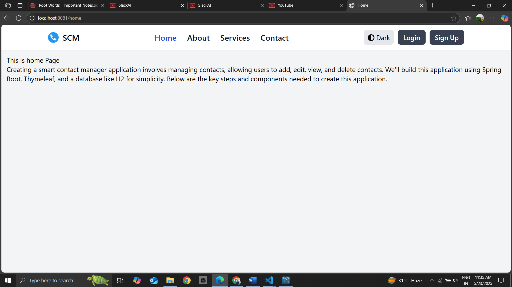
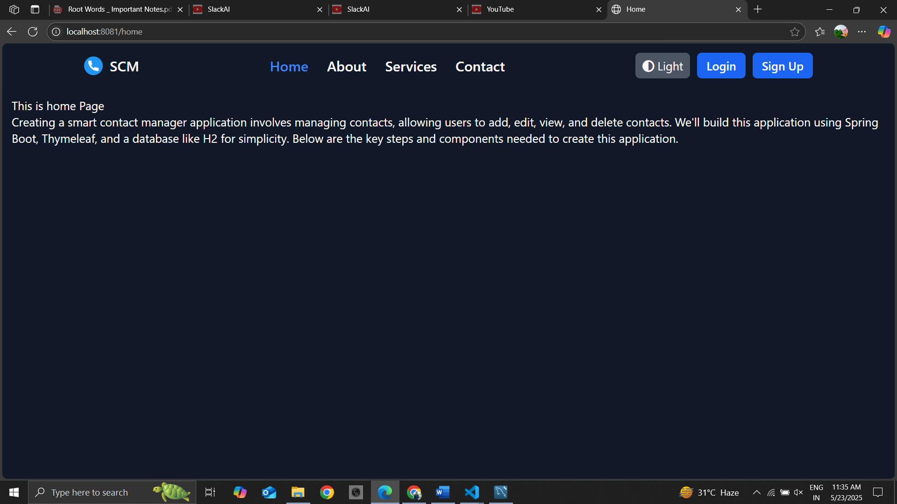
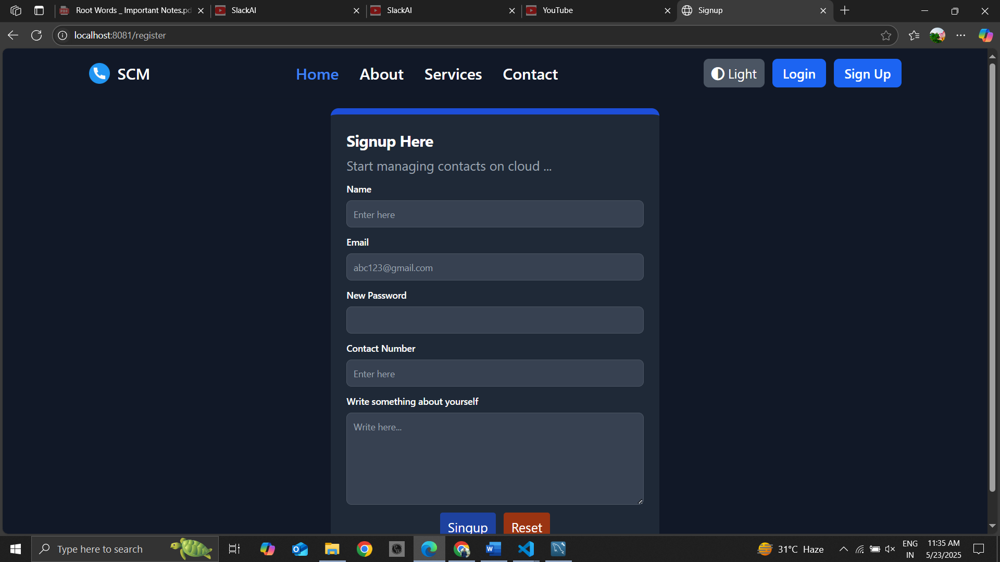
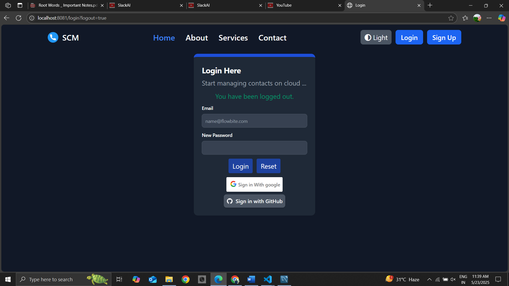
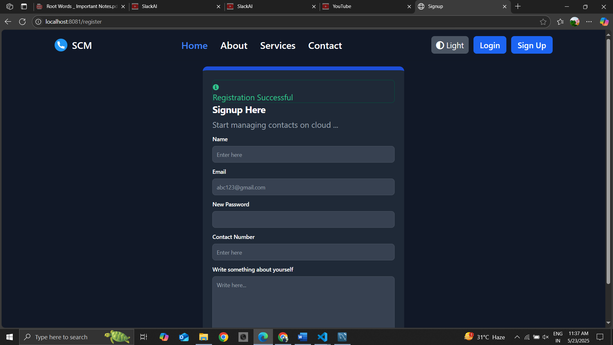
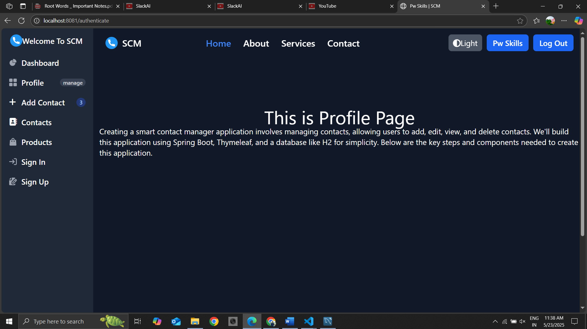
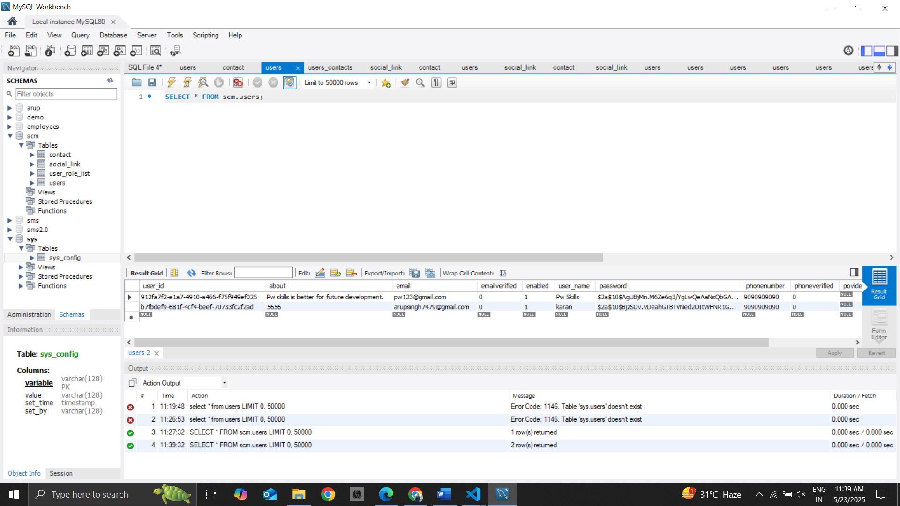

# Smart Contact Manager (SCM)

A Spring Boot application for managing contacts, allowing users to add, edit, view, and delete contacts. The project uses Spring Boot, Thymeleaf, MySQL, and integrates with Google and GitHub OAuth2 for authentication. Cloudinary is used for image storage.

## Features

- User authentication (Google & GitHub OAuth2)
- Manage contacts (CRUD operations)
- Profile management
- Cloudinary integration for image uploads
- Responsive UI with Thymeleaf and Tailwind CSS

## Preview
### 1. Home Page


### 2. Dark Mode


### 3. Signup Page


### 4. Login Page


### 5. Login Successful


### 6. Contact Page


### 7. Profile Page


### 8. Backend Page



## Technologies Used

- Java 17
- Spring Boot 3.x
- Spring Data JPA
- Spring Security & OAuth2 Client
- Thymeleaf
- MySQL
- Cloudinary
- Tailwind CSS

## Getting Started

### Prerequisites

- Java 17+
- Maven
- MySQL

### Setup

1. **Clone the repository:**
   ```sh
   git clone <repository-url>
   cd scm
   ```

2. **Configure the database:**

   Update `src/main/resources/application.properties` with your MySQL credentials if needed.

3. **Configure OAuth2 and Cloudinary:**

   Set your Google, GitHub, and Cloudinary credentials in `src/main/resources/application.properties`.

4. **Install dependencies and build:**
   ```sh
   ./mvnw clean install
   ```

5. **Run the application:**
   ```sh
   ./mvnw spring-boot:run
   ```

6. **Access the app:**

   Open [http://localhost:8081](http://localhost:8081) in your browser.

## Project Structure

- `src/main/java/com/scm/ScmApplication.java` - Main application entry point
- `src/main/resources/templates/` - Thymeleaf templates
- `src/main/resources/application.properties` - Application configuration

## License

This project is for educational purposes.
